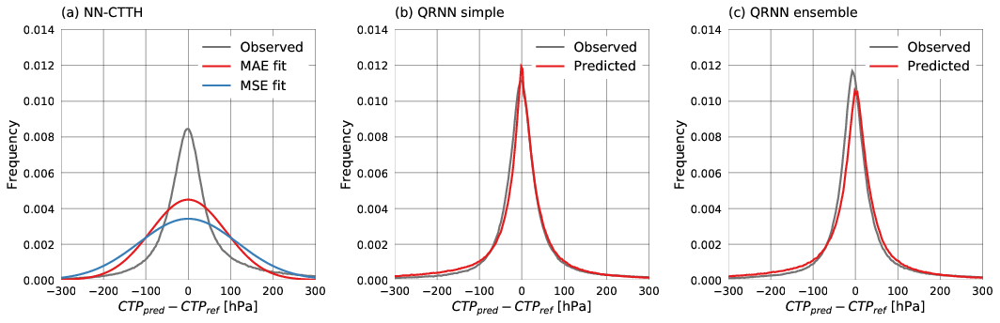

# A cloud top pressure retrieval using QRNNs

This repository contains code used to implement a cloud
top pressure retrieval based on quantile regression neural
networks (QRNNs). It serves mainly as a demonstration of
the capability of QRNNs to to provide well calibrated
estimates of the retrieval *a posteriori* distribution and
provide statistically consistent non-Gaussian error estimates.

